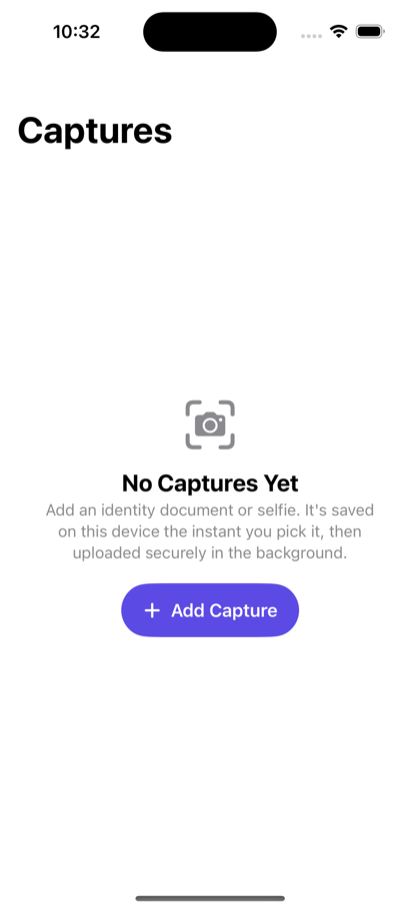
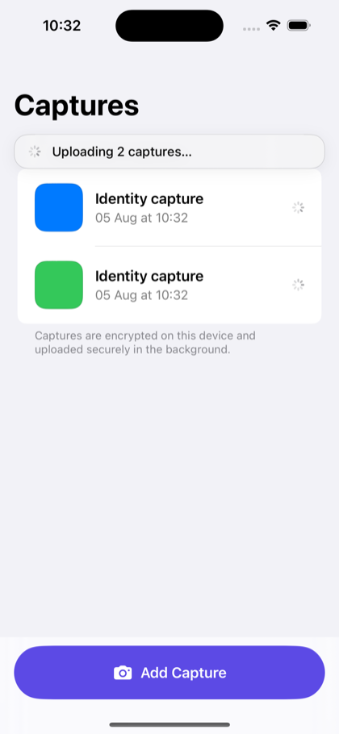
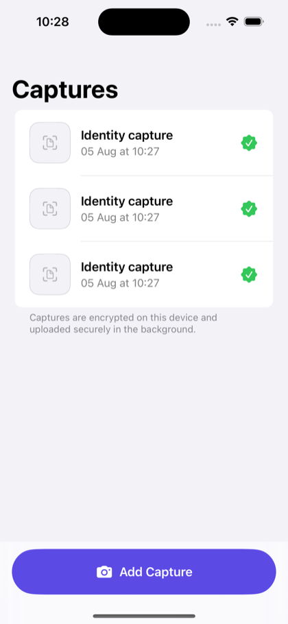
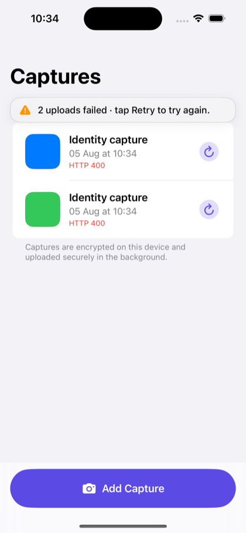
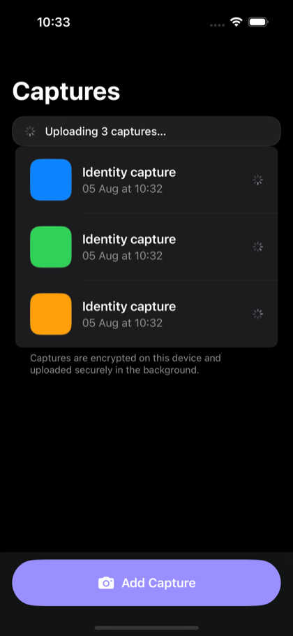
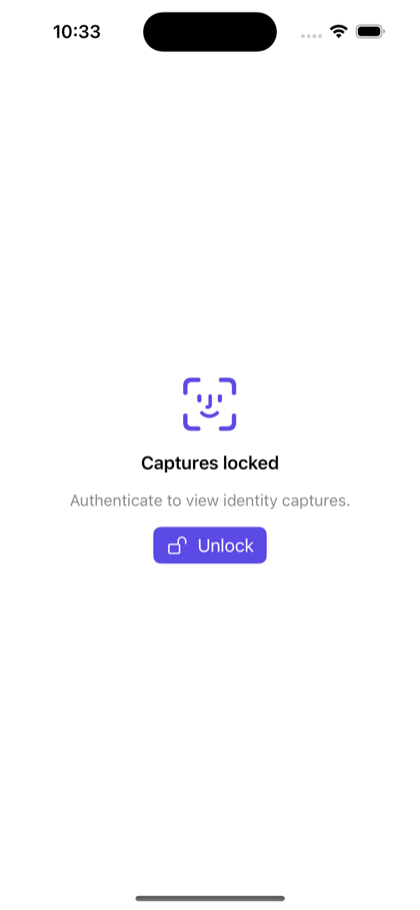
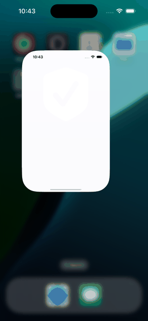
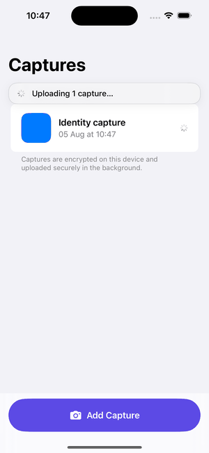

# ResilientCapture


A native iOS proof of concept for iiDENTIFii's problem: capturing an identity
document or selfie on device and delivering it to a verification backend so that
**no completed capture is ever silently lost**, even under patchy networks, app
backgrounding, or a full app relaunch.

The app is a resilient `capture -> local persistence -> background-safe upload`
pipeline. A capture is written to disk and marked `pending` the instant it is
taken, before any network call, and an upload manager delivers it with retry,
backoff, connectivity awareness, and launch-time reconciliation. Uploads are
idempotent on a client-generated id, so a retry after a crash can never create a
duplicate verification.

SwiftUI, iOS 17+, no third-party dependencies.

## Screenshots

| Empty | Uploading | Uploaded | Failed |
|:---:|:---:|:---:|:---:|
|  |  |  |  |

| Dark mode | Locked (Face ID) |
|:---:|:---:|
|  |  |

**Network states.** Captured while offline, the queue holds as *Waiting* under an
offline notice; the moment connectivity returns it uploads automatically and
settles on *Uploaded*, with no action from the user:



**Killed mid-upload.** The app is force-killed while an upload is in flight (note
the return to the home screen); on relaunch the interrupted capture is re-driven
automatically and finishes as *Uploaded*. It is delivered exactly once (the
backend deduplicates on the capture id), so nothing is lost or duplicated:



## Scope

This project was built against a four-hour brief. To keep the mapping to that
brief clear, the work is split into two groups. Both are fully built, tested, and
documented; the split is only about what the brief asked for versus what was added
on top.

**Core deliverable (the brief).** The resilient pipeline and everything the
requirements list asks for:

- Persistence-first capture queue (image + `pending` metadata on disk before any
  network call).
- Capture flow, background-safe upload manager with retry and exponential backoff.
- Connectivity awareness and lifecycle/relaunch resume, without duplicates.
- Status UI for all four states with manual retry.
- Unit tests for persistence and retry/resume, plus end-to-end verification of the
  kill / connectivity-loss / relaunch scenarios.
- Design, concurrency, and trade-off documentation.

These correspond to the first seven commits (`scaffold` through the retry/resume
tests).

**Extensions added afterwards (beyond the brief).** Everything below the "well
tested" and "reasonably secure" lines the brief mentions, taken further than the
time box required:

- Security: AES-256-GCM encryption at rest with a Keychain-held key, data
  minimisation, TLS certificate pinning, bearer-token auth, a backgrounding
  privacy screen, and a Face ID / passcode gate.
- Presentation: an Apple HIG-aligned UI pass, a custom accent colour, and an app
  icon.

## Getting started

First time with this project? Follow these steps top to bottom. It takes about
two minutes and needs nothing installed beyond Xcode.

### What you need

- A Mac with **Xcode 16 or later** (built and tested on Xcode 26). Installing
  Xcode also installs the iOS simulators and the command-line tools.
- **Python 3** for the mock backend. It is preinstalled on macOS. Check with
  `python3 --version`.

You will use one terminal window for the mock server and Xcode for the app. The
server and the app are pre-configured to talk to each other on port `8080`, so
there is nothing to configure.

### Step 1: Start the mock server

In a terminal, from the project's root folder:

```bash
python3 mock-server/server.py
```

You should see `Mock backend listening on http://localhost:8080`. Leave this
window open and running (press `Ctrl+C` to stop it later). It uses only the
Python standard library, so there is no `pip install`.

### Step 2: Open and run the app

Open the project in Xcode (from the same folder, in a second terminal, or by
double-clicking it in Finder):

```bash
open ResilientCapture.xcodeproj
```

In Xcode:

1. At the top of the window, next to the app name, pick an **iPhone simulator**
   (for example "iPhone 16"). Make sure a simulator is selected, not a physical
   device.
2. Press the **Run** button (the triangle), or `Cmd + R`.

Xcode builds the app and launches the simulator. No signing or Apple ID is needed
for the simulator.

### Step 3: Try it

1. Tap **Add Capture** and pick any photo from the simulator's library. (The
   simulator ships with sample photos. Photo-library selection is used so the
   flow works without a real camera.)
2. The capture appears immediately as **Waiting**, then moves to **Uploading**
   and finally a green **Uploaded** seal, once the mock server confirms it.
3. Watch the mock server terminal: you will see a `200 OK` line for each upload.

That is the full pipeline working: a capture is saved on the device first, then
uploaded in the background.

### Optional: see the resilience in action

Stop the mock server (`Ctrl+C`) and start it again with a fault injected, then add
a capture and watch how the app copes:

```bash
# Fail the first two attempts of every upload, then succeed (shows retry + backoff)
FAIL_FIRST_N=2 python3 mock-server/server.py

# Always return an error (shows a Failed item with a Retry button)
FORCE_STATUS=400 python3 mock-server/server.py
```

More options (slow network, dropped connections, HTTPS with certificate pinning,
bearer-token auth) are in [mock-server/README.md](mock-server/README.md).

### Optional: run the tests

From a terminal in the project root:

```bash
xcodebuild test \
  -scheme ResilientCapture \
  -destination 'platform=iOS Simulator,name=iPhone 16' \
  CODE_SIGNING_ALLOWED=NO
```

40 tests covering persistence, encryption, backoff, the upload state machine, and
the transport-security helpers.

### Troubleshooting

- **`OSError: [Errno 48] Address already in use`** when starting the server. A
  server is already running on port 8080. Stop it with
  `lsof -ti:8080 | xargs kill`, then start it again. (Or run on another port with
  `PORT=8081 python3 mock-server/server.py` and update the endpoint in
  [AppConfig.swift](ResilientCapture/Support/AppConfig.swift).)
- **Captures stay on "Waiting" or "Uploading" and nothing reaches the server.**
  The mock server is not running, or not on port 8080. Start it (Step 1). The app
  retries on its own, so items upload as soon as the server is up.
- **A "Captures locked" screen appears.** That is the Face ID / passcode gate. On
  a simulator with no passcode it lets you straight through; if you see it, tap
  **Unlock**. To disable it entirely, run the app with
  `-disableBiometricGate YES` in the scheme's arguments (Product > Scheme > Edit
  Scheme > Run > Arguments).
- **The photo picker is empty.** Drag any image file onto the simulator window to
  add it to the simulator's Photos, then try again.
- **Xcode mentions code signing.** It is not needed for the simulator. Just
  confirm a simulator (not a device) is selected at the top.

## What it demonstrates

| Scenario | Guarantee | How |
|----------|-----------|-----|
| App killed mid-upload | Capture is not lost | Image + `pending` metadata are written to disk before any network call; on relaunch `resume()` re-drives interrupted items |
| App killed mid-upload | No duplicate verification | Capture id is an idempotency key; the backend stores it once, so a re-upload is deduped |
| Connectivity lost | Uploads pause, nothing lost | `NWPathMonitor` reports offline; items stay `pending`, retry timers are cancelled |
| Connectivity restored | Uploads resume automatically | Reconnect triggers `resume()` |
| Full relaunch | Queue survives | Queue state lives in per-item files on disk, reloaded on launch |
| Transient server error (5xx/timeout) | Retried, then delivered | Exponential backoff with jitter, capped, bounded attempts |
| Permanent error (4xx) | Not retried, surfaced for manual retry | Marked `failed`; the user can tap Retry |

The user is kept informed with a small, non-invasive status banner (offline,
uploading N, N failed, all uploaded) that also notes Cellular / Low Data Mode.

## Security

Because the payload is identity documents and selfies, the captures are protected
at rest:

- **Encrypted at rest.** Image bytes are sealed with AES-256-GCM (CryptoKit)
  before they touch disk, so the stored files are ciphertext. The key lives in
  the **Keychain** (`afterFirstUnlockThisDeviceOnly`, so it never syncs to iCloud
  and is never in backups), with a Data-Protected key-file fallback for unsigned
  builds.
- **iOS Data Protection** (`completeUntilFirstUserAuthentication`) on every write,
  and the queue directory is **excluded from iCloud/iTunes backup**.
- **Data minimisation.** Once an upload is confirmed, the local image bytes are
  **erased**, keeping only a metadata receipt. Delivered identity images do not
  linger on the device.
- Since a background upload must send from a file, the store vends a short-lived
  **decrypted** temp file for the transport, deleted on completion and purged on
  launch, so plaintext exists only during an active upload.

In transit and on device:

- **TLS certificate pinning + bearer-token auth.** The upload transport pins the
  server certificate (rejecting a mismatched cert even if validly issued) and
  sends an `Authorization: Bearer` token from the Keychain. Verified end to end
  against a self-signed HTTPS mock: correct pin uploads, wrong pin is rejected,
  missing token gets a 401.
- **Backgrounding privacy screen.** A cover view hides identity content whenever
  the app is not active, so it never leaks into the app-switcher snapshot.
- **Biometric gate.** Face ID / Touch ID (with passcode fallback) is required to
  view the captures.

See DESIGN.md, "Security", for the full rationale and the pinning demo commands.

## Project structure

```
ResilientCapture/
  Models/            CaptureItem + UploadState (the state machine); StatusMessage
  Persistence/       CaptureQueueStore (protocol) + FileCaptureQueueStore (actor)
  ImageProcessing/   ImageIO downsampling (memory-safe capture handling)
  Upload/            UploadTransport (protocol), BackgroundUploadTransport,
                     RetryPolicy, UploadManager (the orchestrator)
  Connectivity/      ConnectivityMonitor (protocol), PathConnectivityMonitor,
                     ScriptedConnectivityMonitor, NetworkStatus
  Queue/             CaptureQueueModel (@Observable UI facade)
  Views/             ContentView, CaptureRowView, ThumbnailView, StateBadgeView,
                     StatusBannerView
  Support/           AppConfig, AppLaunch (composition root + test seam)
ResilientCaptureTests/   store, retry policy, and upload-manager tests + fakes
mock-server/             dependency-free Python mock backend
```

See [DESIGN.md](DESIGN.md) for the architecture, the concurrency and threading
model, and the trade-offs made within the time box.

## Known limitations

- **Background uploads in the Simulator.** The iOS background transfer daemon is
  not functional in the Simulator, so the app uses a background `URLSession` on
  device and a standard `URLSession` in the Simulator. This does not weaken the
  resilience guarantees for the scenarios above, which come from the durable
  store, launch reconciliation, and server idempotency rather than from the OS
  continuing a suspended transfer. See DESIGN.md for detail.
- **The Keychain needs a signed build.** An unsigned Simulator build has no
  entitlement for the Keychain, so the encryption key falls back to a
  Data-Protected key file. A normal signed run (Xcode Run, or device) uses the
  Keychain. This is a build-environment limitation, not a design one.
- **The default endpoint is the plain-http mock.** TLS pinning and auth are
  implemented and verified against a self-signed HTTPS mock (via launch-flag
  overrides); a production build would ship the real HTTPS endpoint and pins in
  `AppConfig`.
- **The mock backend keeps state in memory** and resets on restart. It is a test
  stub, not a real service.
